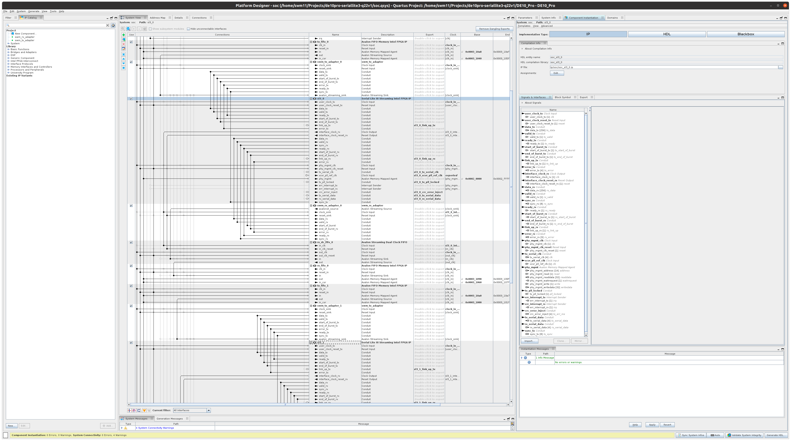

# DE10Pro/Stratix 10 Test of Serial Lite III

## Notes

* Main system under test is a Platform Designer project soc.qsys

## Software for Nios-V processor

* [Nios-V quick start guide from Intel](https://usermanual.wiki/m/464277d99f971805ff972a1bd8eef56602928f237221631fb7126fa954e03d0a.pdf)
* Board support package (BSP) can be generated within Platform Designer: File->New BSP
  * I put the bsp in: software/bsp/settings.bsp
* From the command-line in software/bsp generate the BSP files:

```
niosv-bsp -g settings.bsp
```

* Simple top-level C file put in app/main.c:

```
#include "HAL/inc/sys/alt_stdio.h"

int
main(void)
{
  alt_putstr("Hello World!\n");
  return 0;
}
```

* generate the CMakeLists.txt:

```
niosv-app --dir=./ --bsp-dir=../bsp --srcs=main.c --elf-name=main.elf
```

* build using:

```
make
```

* start a jtag terminal, e.g. in a new xterm window:

```
xterm -e juart-terminal &
```

* download and run the code:

```
niosv-download -g main.elf
```
## Tuning Serial Links

Analog parameters for serial links can be tuned using System Console.
Please see the demonstration video below.  The tuned analog (PMA)
parameters are included in the DE10Pro.qsf file.

[](https://youtu.be/y_UbtNqbIaM)

## SerialLite III Signals and Mappings

| Signal name | input/output | width | mapping |
|:--|:-:|--:|:--|
|**Data to send stream** | | | |
|user_clock_tx       | clock input | 1 | clock for data send stream; currently 100MHz system clock for the NIOS test setup |
|user_clock_reset_tx | reset input | 1 | reset that goes with the above clock |
|data_tx             | data input | 256 | data to be transmitted; from memory mapped FIFO via an adapter that zero extends from 32b (NIOS side) to 256b |
|valid_tx            | control input | 1 | valid signal for data_tx |
|ready_tx            | control output | 1 | ready signal for the above, i.e. if ready to send a word; also status signal that serial TX is up |
|start_of_burst_tx   | metadata input | 1 | goes with data_tx to signal start of a packet in avalon-stream speak |
|end_of_burst_tx     | metadata input | 1 | goes with data_tx to signal end of a packet in avalon-stream speak |
|sync_tx             | status input   | 8 | caputured at start-of-burst and end-of-burst; end-of-burst to indicate number of 64b words valid; currently sending zero |
|**Data received stream**   | | | |
|interface_clock_rx  | clock output | 1 | clock recovered from serial RX data; around 366MHz |
|interface_clock_reset_rx | reset output | 1 | reset that goes with the above; use to reset receiver FIFO |
|data_rx             | data output    | 256 | data received; sent to narrowing adapter (keeps bottom 32b) and then a clock crossing FIFO |
|valid_rx            | control output |   1 | valid signal that goes with data_rx |
|ready_rx            | control input  |   1 | indicate if receiver FIFO has space; unclear to me if this back propagates very far |
|start_of_burst_rx   | metadata output |  1 | goes with data_rx to signal start of packet in avalon-stream speak |
|end_of_burst_rx     | metadata output |  1 | goes with data_rx to signal end of packet in avalon-stream speak |
|sync_rx             | status output   |  8 | counterpart to sync_rx |
|**Link Status**     | | | |
|link_up_tx          | status output | 1 | indicates that the serial TX is up; currently attached to a PIO input to allow status to be read |
|link_up_rx          | status output | 1 | indicates that the serial RX is up; currently attached to a PIO input to allow status to be read |
|error_tx            | status output | 4 | see definition below |
|error_rx            | status output | 5 | see definition below |
|**Physical management** | **memory mapped registers** | | **Avalon MM** |
|phy_mgmt_address        | input  | 14 | address (32b aligned) |
|phy_mgmt_read           | input  | 1  | read enable |
|phy_mgmt_readdata       | output | 32 | data read |
|phy_mgmt_waitrequest    | output | 1  | wait control  |
|phy_mgmt_write          | input  | 1  | write enable |
|phy_mgmt_writedata      | input  | 32 | write data |
|**Unused signals** | | | |
|err_interrupt_tx | output | 1 | signals error on transmit; currently unused |
|err_interrupt_rx | output | 1 | signals error on receive; currently unused |
|crc_error_inject | input  | 4 | force a CRC error for testing; currently zero |
|**External Pins** | | | |
|tx_serial_data | output | 4 | to serial TX pins |
|rx_serial_data | input  | 4 | from serial RX pins |

* **error_tx** - This vector indicates an overflow in the source adaptation module’s FIFO buffer.
  * Bit 0: Source adaptation module’s FIFO buffer overflow
  * Bit 1: An SEU error occurred and was corrected (ECC enabled). Don't care (ECC disabled)
  * Bit 2: An SEU error occurred and cannot be corrected (ECC enabled). Don't care (ECC disabled)
  * Bit 3: A burst gap error occurred due to a mismatch in the BURST GAP parameter value and the gap between end of burst and start of burst.
* **error_rx** - This vector indicates the state of the sink adaptation module’s FIFO buffer. N represents the number of lanes.  N=4 in our setup:
  * [N+4]: Since we're using advanced clocking mode, this is don't care, so we've removed it from our error status.
  * [N+3]: Since we're using advanced clocking mode, this is don't care, so we've removed it from our error status.
  * [N+2]: Since we're using advanced clocking mode, this is don't care, so we've removed it from our error status.
  * [N+1]: Don't care. Tied to zero. So we've removed it from our error status.
  * [N]: Loss of alignment
  * [N-1:0]: PCS sync header, multiframe, or CRC-32 error

## Platform Designer

The components of the design are captured in Platform Designer.
Currently this is rather verbose since many of the Serial Lite III
interfaces are conduits rather than being bundles into higher-level
interfaces linke Avalon Streaming.


